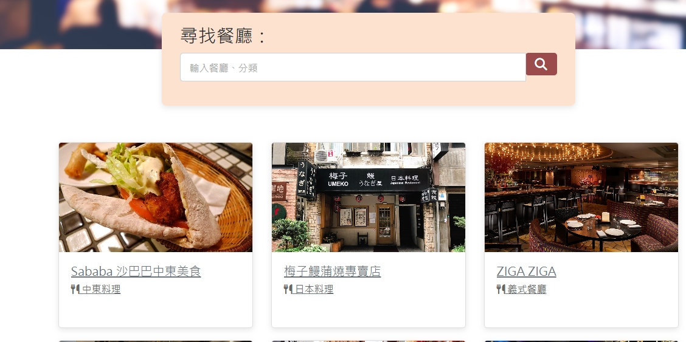

# 我的餐廳清單

## 介紹

可以瀏覽餐廳列表、詳細餐廳資訊及搜尋餐廳

### 功能

- 查看所有餐廳
- 瀏覽餐廳的相關資訊
- 搜尋特定餐廳

## 安裝步驟

1. 透過終端機指令 git clone 複製專案至本地 
2. 在終端機輸入： npm install
3. 安裝完畢後，輸入： nodemon app.js 執行專案
4. 如果執行成功會出現此訊息 Server is listening on http://localhost:3000
5. 進入到以下網址 http://localhost:3000
6. 若欲暫停使用ctrl + c

## 開發工具

- Node.js 
- Express 4.16.4
- Express-Handlebars@3.0.0
- Bootstrap 4.3.1
- Font-awesome 5.8.1